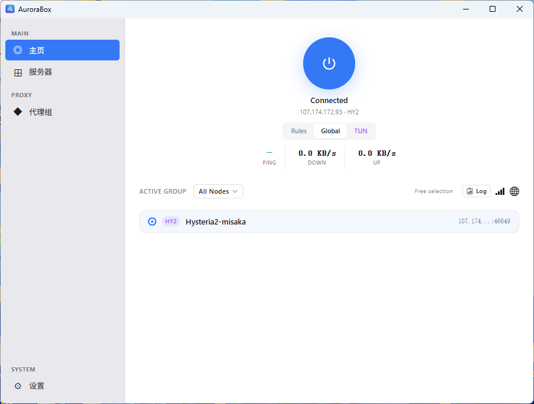
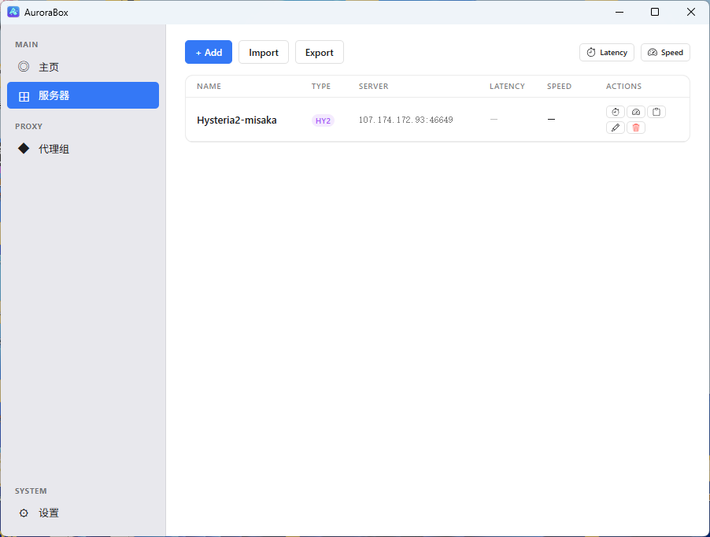
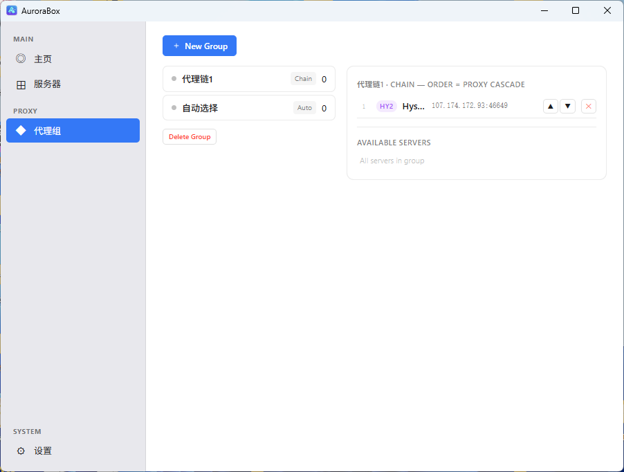
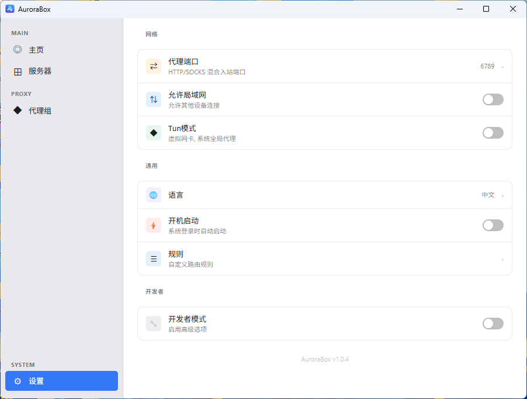

<div align="center">
  

  <p>
    <a href="./README_CN.md">简体中文</a>
    ·
    <a href="#screenshots">Screenshots</a>
    ·
    <a href="#features">Features</a>
    ·
    <a href="#download">Download</a>
    ·
    <a href="#development">Development</a>
  </p>

  <p>
    <a href="https://github.com/SagerNet/sing-box"></a>
    <a href="https://github.com/guaixian/AuroraBox/releases"></a>
    <a href="./LICENSE"></a>
  </p>
</div>

## About

AuroraBox is a cross-platform desktop proxy client built with Tauri 2, React, TypeScript, Rust, and the [sing-box](https://github.com/SagerNet/sing-box) network core.

It is designed for people who want a clean daily-driver client: add server configurations, organize them into groups, pick a route mode, start the service, and let the app handle the platform details.

## Features

### Proxy Protocols
AuroraBox supports importing and managing servers across 6 protocols:

| Protocol | Import | TLS/Reality | Transport |
|----------|--------|-------------|-----------|
| **Hysteria2** | URI / Share Link | ✅ TLS | ✅ |
| **VLESS** | URI / Share Link | ✅ Reality | ✅ ws, grpc, tcp |
| **Trojan** | URI / Share Link | ✅ TLS | ✅ ws, grpc |
| **Shadowsocks** | URI / Share Link | — | 2022-blake3, AEAD |
| **SOCKS5** | Manual | — | — |
| **HTTP** | Manual | — | — |

### Proxy Groups
Organize servers into groups with 4 selection strategies:

| Group Type | Behavior |
|------------|----------|
| **Fixed** | Manual node selection; reorderable priority |
| **Auto (URLTest)** | Automatic latency-based best-node selection |
| **Random** | Random node per connection for load distribution |
| **Chain Cascade** | Multi-hop chain (A→B→C) with independent sing-box instances |

### Testing & Monitoring
- **Latency test** — real HTTP timing via proxy (gstatic.com)
- **Speed test** — timed download throughput measurement (multi-source fallback)
- **Real-time traffic** — cumulative up/down stats from sing-box Clash API (polling)

### Route Modes

| Mode | Description |
|------|-------------|
| **Rules** | Domain/IP-based routing via sing-box rule-set |
| **Global** | All traffic routed through proxy |
| **TUN** | Virtual NIC for system-wide proxy (privileged mode) |

### Platform Features
- **System tray** — minimize to tray, quick mode switch, quit
- **System proxy** — auto set/clear HTTP/HTTPS/SOCKS proxy (Linux/macOS/Windows)
- **Auto start** — launch on system login
- **Allow LAN** — share proxy with other devices on the network
- **Developer mode** — advanced settings, log viewer, config inspection, DevTools

### Cross-Platform Builds
CI builds all platforms on every release tag:

| Platform | Architectures | Package |
|----------|--------------|---------|
| Linux | x86_64, aarch64 (ARM64) | `.deb` + `.rpm` |
| macOS | aarch64 (Apple Silicon) | `.dmg` |
| Windows | x86_64 | `.msi` + `.exe` |

### Internationalization
- English / 简体中文 language switch
- All UI labels, toasts, and dialogs translated

## Screenshots

| Home | Servers | Groups | Settings |
| :---: | :---: | :---: | :---: |
|  |  |  |  |

## Download

Get the latest build from the [GitHub Releases page](https://github.com/guaixian/AuroraBox/releases).

## Development

### Prerequisites
- [Deno](https://deno.com) 2.x
- [Rust](https://rustup.rs) stable
- Linux: `libwebkit2gtk-4.1-dev libgtk-3-dev libsoup-3.0-dev libjavascriptcoregtk-4.1-dev`

### Quick Start

```bash
# Install dependencies
deno install
deno task prepare

# Start dev server (frontend HMR + Rust hot-reload)
deno task tauri dev

# Run frontend tests
deno task test

# Run Rust tests
cargo test --manifest-path src-tauri/Cargo.toml

# Build production frontend
deno task build

# Build release package (deb/dmg/msi)
deno task tauri build
```

### Project Structure

```
src/                  — React/TypeScript frontend
src-tauri/            — Rust backend (Tauri 2)
  src/commands/       — Tauri command handlers (IPC)
  src/engine/         — Platform engine (macOS/Linux/Windows)
  src/core/           — Lifecycle state machine, process manager
lang/                 — i18n JSON (en.json, zh.json)
scripts/              — Build, CI, and utility scripts
.github/workflows/    — CI/CD (multi-platform build + release)
```

Config templates are synced from upstream at build time via `scripts/sync-templates.ts`.

## License

Licensed under the [Apache License 2.0](./LICENSE).

AuroraBox is a fork of OneBox by OneOh Cloud LLC. The original **OneBox** name, logos, and icons are proprietary assets of OneOh Cloud LLC. The Apache License does not grant permission to use those branding elements in derivative works. See [NOTICE](./NOTICE).
